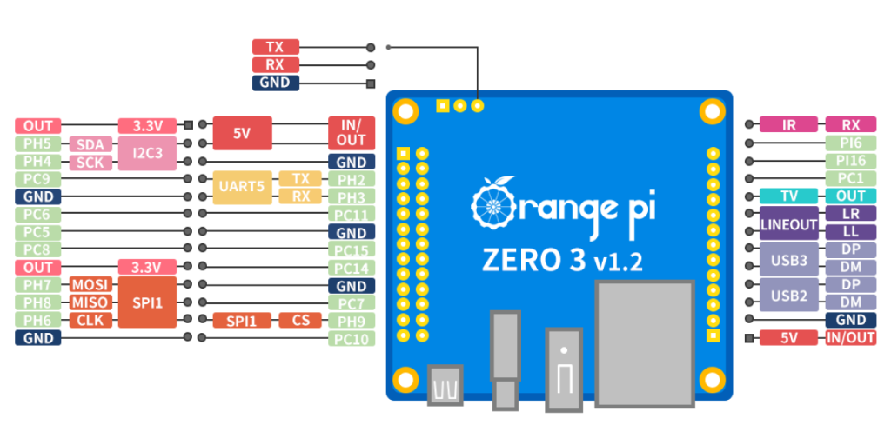

# Orange Pi Zero 3 GPIO API

A FastAPI-based REST API to control the GPIO pins on an Orange Pi Zero 3 (v1.2).

## Installation
For a fresh setup, you can run the automated installation script:
```bash
cd /root/opi_gpio_app
chmod +x install.sh
./install.sh
```
This script will install system dependencies, setup the virtual environment, install requirements, and configure the systemd service.

## Hardware Setup
This application is configured for the **26-pin header** of the Orange Pi Zero 3 v1.2.



### Mapping Table (from Official Image)
| Header Pin | Image Label | GPIO Bank | GPIO Line Offset |
| :--- | :--- | :--- | :--- |
| **Pin 3** | PH5 | PH | **229** |
| **Pin 5** | PH4 | PH | **228** |
| **Pin 7** | PC9 | PC | **73** |
| **Pin 11** | PC6 | PC | **70** |
| **Pin 12** | PC11 | PC | **75** |
| **Pin 13** | PC5 | PC | **69** |
| **Pin 15** | PC8 | PC | **72** |
| **Pin 16** | PC15 | PC | **79** |
| **Pin 18** | PC14 | PC | **78** |
| **Pin 19** | PH7 | PH | **231** |
| **Pin 21** | PH8 | PH | **232** |
| **Pin 22** | PC7 | PC | **71** |
| **Pin 23** | PH6 | PH | **230** |
| **Pin 24** | PH9 | PH | **233** |
| **Pin 26** | PC10 | PC | **74** |

## API Usage
- **Swagger Docs**: `http://<IP>:8000/docs`
- **Health Check**: `GET /health` (Monitors API, GPIO status, and CPU temperature)
- **Check Status**: `GET /pins/status` (Now shows if a pin is Input or Output)
- **Read Interrupts**: `GET /events` (Returns and clears the queue of recent edge events)
- **Set Pin**: `POST /pins/set {"pin_num": 15, "state": 1}`
- **Toggle Pin**: `POST /pins/toggle/15`
- **Set All Low**: `POST /pins/all/low`
- **View Logs**: `GET /logs`

## Input & Interrupts
The API now supports configuring pins as inputs with edge detection (interrupts).

- **Configuration**: Set `"direction": "input"` and optional `"bias": "pull-up"`/`"pull-down"` in `gpio_config.json`.
- **Interrupts**: The system automatically monitors inputs for both Rising and Falling edges. 
- **Retrieval**: Use the `/events` endpoint to fetch the event queue. Each event includes the pin number, event type, and a nanosecond timestamp.

Example `/events` response:
```json
{
  "events": [
    {"pin": 26, "event": "Falling", "timestamp": "48114713864866"}
  ]
}
```

## Loxone Integration
This API serves as a native extension for Loxone Smart Home.

### 1. Download Templates
Use these endpoints to download pre-configured XML templates for Loxone Config:
- **Virtual Inputs**: `GET /loxone/template/inputs`
- **Virtual Outputs**: `GET /loxone/template/outputs`
- **System Stats**: `GET /loxone/template/stats`
- **Network Status**: `GET /network/status`
- **Scan Networks**: `GET /network/scan`
- **Connect Wi-Fi**: `POST /network/connect` (Body: `{"ssid": "MyWiFi", "password": "password"}`)
- **Set Ethernet**: `POST /network/ethernet` (Body: `{"method": "manual", "ip": "192.168.1.50/24", "gateway": "192.168.1.1", "dns": "8.8.8.8"}` or `{"method": "auto"}`)

### 2. Status for Parsing
Loxone can poll the plain-text status endpoint which is optimized for "Command Recognition":
- `GET /loxone/status`
- Format: `Pin X=Y` (Example: `Pin 26=1`)
- Command Recognition Pattern: `Pin 26=\v`

## Service Management
The application is configured as a `systemd` service and will start automatically on boot.

- **Check Status**: `systemctl status opi_gpio.service`
- **Restart App**: `systemctl restart opi_gpio.service`
- **Stop App**: `systemctl stop opi_gpio.service`
- **Disable Auto-start**: `systemctl disable opi_gpio.service`

## Logs
Logs are stored in `/root/opi_gpio_app/app.log` and can also be viewed via the API at `GET /logs`.
